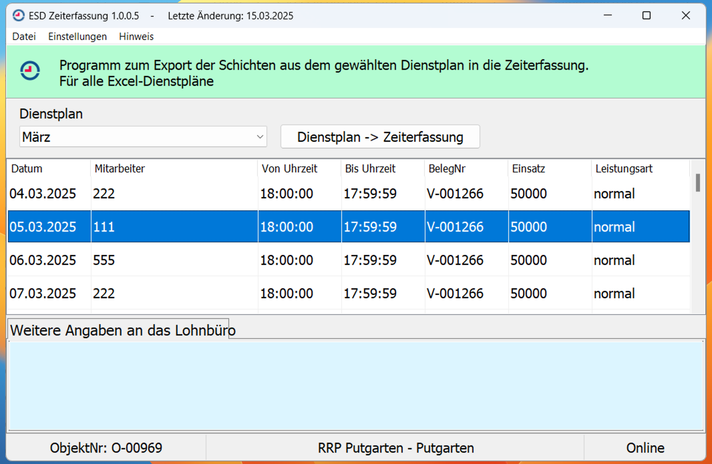
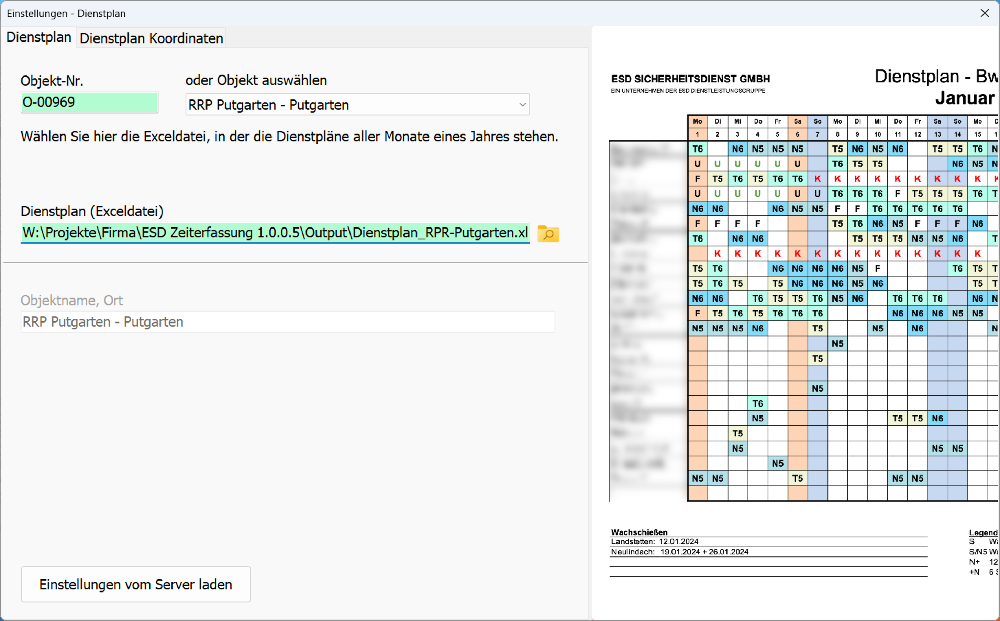
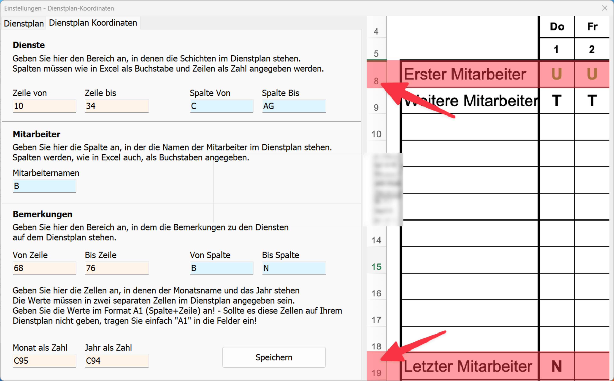
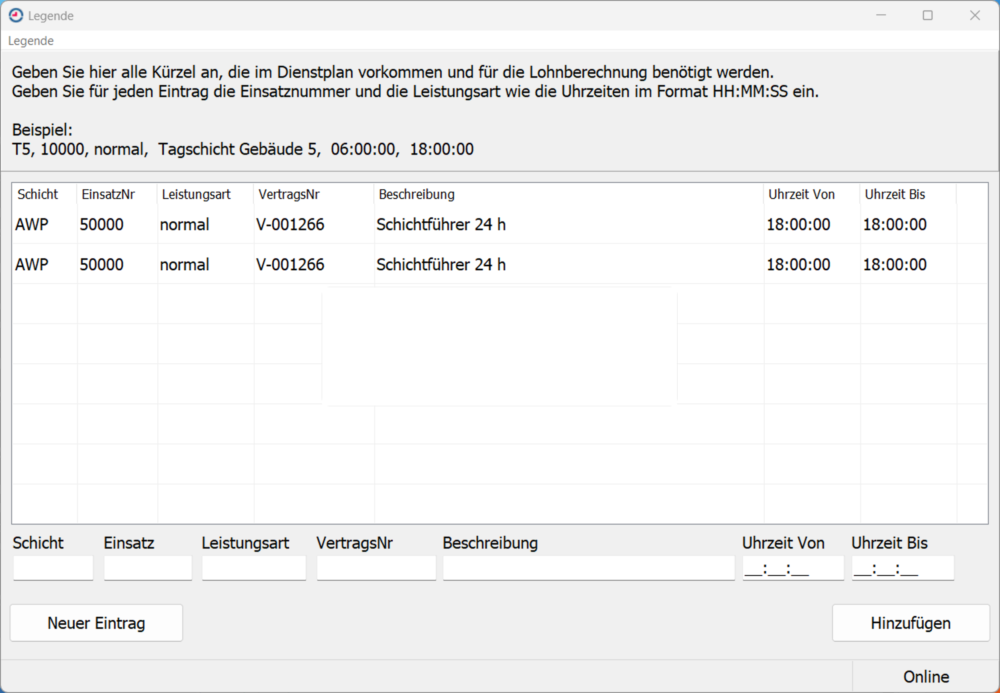
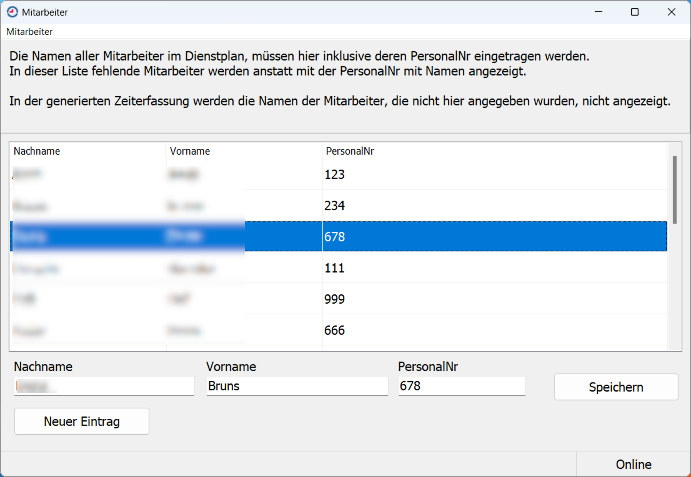

# ESD-Zeiterfassung 1.0.0.5

Dies ist ein Open Source Delphi-Projekt zur Zeiterfassung mit SQLite und OpenSSL.
Diese Version ist für beliebige Dienstplan Exceldateien geeignet da man in den Einstellungen des Programms,
sämtliche Koordinaten, an denen die zu extrahierenden Daten stehen, angeben und speichern kann.

## Merkmale
- Plattform: Windows
- Programmiert in: Delphi
- Datenbank: SQLite3
- Verschlüsselung: OpenSSL (libeay32.dll, ssleay32.dll)

## Lizenz

Veröffentlicht unter der MIT-Lizenz – siehe [LICENSE](./LICENSE).

[Download der aktuellen Version](https://github.com/es3006/Zeiterfassung-1.0.0.5/releases/latest)

## Screenshots

**Hauptfenster:**

**Einstellungen:**

**Koordinaten:**

**Legende:**

**Mitarbeiter:**

# Zeiterfassung-1.0.0.5 
# Zeiterfassung-1.0.0.5 
# Zeiterfassung-1.0.0.5 
